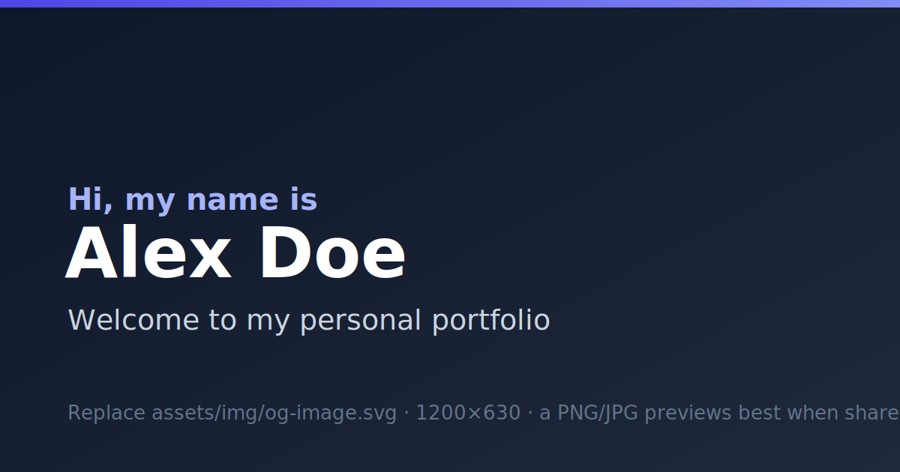

# Starter — a free personal portfolio template

A clean, modern, **one-file-to-edit** personal website for your projects, experience, and CV.
No coding experience needed. No build tools. No accounts required to try it.

You change one file — **`config.js`** — and the whole site updates.



> **Live demo:** _add your link here once it's online_ → `https://your-username.github.io/your-repo/`

---

## ✅ Edit these first (a 5-minute checklist)

Open **`config.js`** in any text editor and change these six things. Everything else already looks finished — you can come back to it later.

1. **Your name** — `HERO → name`
2. **Your tagline** — `HERO → tagline`
3. **Your photo** — `ABOUT → photo` (drop an image into `assets/img/`)
4. **One project** — the first item under `PROJECTS`
5. **Your email** — `CONTACT → email` (and the `mail` entry under `SOCIAL`)
6. **The colour** — `THEME → palette` (`"slate"`, `"forest"`, `"sunset"`, or `"violet"`)

Save the file, then refresh the page in your browser. That's it.

> 🔎 Tip: every editable line in `config.js` has a `👉 EDIT` note next to it telling you what it is.

---

## What you get

- 📱 **Looks great on phones and laptops** (360px → 1440px), with light & dark mode.
- 🎨 **4 ready-made colour palettes** — switch by changing one word.
- 🧭 **A built-in “Start here” helper** right on the page that walks you through your first edits (with one-click colour previews) — and disappears in one line when you're done.
- 🙂 **Generic, anyone-can-use example content** — student, designer, writer, maker, career-changer. It's not tied to any one job, so it's easy to make it *yours*.
- 🧩 **Every section a portfolio needs**: hero, about, "now", experience, education, skills, projects, writing, references, and contact.
- ♿ **Accessible & fast** — keyboard-friendly, screen-reader labels, respects "reduce motion", prints as a tidy résumé.
- 🔍 **Ready for Google & social sharing** — title, description, preview image, sitemap.
- 🛠️ **Plain HTML/CSS/JavaScript** — no build step, nothing to install, easy for you (or an AI assistant) to read.

---

## Quick start (5 minutes)

1. **Get the files** — click the green **“Use this template”** button at the top of the GitHub page (or **“Download ZIP”** and unzip it).
2. **Open the folder** in a text editor. [VS Code](https://code.visualstudio.com/) is free and great, but any editor works.
3. **Edit `config.js`** — do the [✅ checklist](#-edit-these-first-a-5-minute-checklist) above.
4. **Preview it** — see [Run it on your own computer](#run-it-on-your-own-computer) below.
5. **Put it online** — see [Put it online with GitHub Pages](#put-it-online-with-github-pages).

---

## Run it on your own computer

You want to *see* your changes before putting the site online. Here are three ways, easiest first.

### Option A — just double-click `index.html` (easiest)

Double-click `index.html` and it opens in your web browser. Done.

This works for almost everything. The only catch: a couple of browser features behave slightly differently when opening a file directly (the address bar says `file:///…`). If anything looks off, use Option B.

### Option B — a tiny local web server (recommended)

This runs the site exactly like a real website. Pick whichever you have:

- **VS Code “Live Server” extension** (no command line):
  1. Install the **Live Server** extension from the Extensions panel.
  2. Right-click `index.html` → **“Open with Live Server”**.
  3. Your browser opens at `http://localhost:5500` and **auto-refreshes** when you save.

- **Node.js** (one command):
  ```bash
  npx serve
  ```
  Then open the address it prints (usually `http://localhost:3000`).

- **Python** (already installed on most Macs/Linux):
  ```bash
  python -m http.server 8000
  ```
  Then open `http://localhost:8000`.

> **What does “localhost” mean?** It’s your *own computer* pretending to be a web server, just for you. Nobody else can see `localhost` — it’s a private preview. The address `http://localhost:8000` simply means “the website running on my machine, on door number 8000”.

### Option C — let an AI assistant run it for you

If you’re using an AI coding assistant (next section), you can literally ask: *“start a local preview server so I can see the site.”*

---

## Edit it with an AI coding assistant (great for beginners)

You do **not** need to know how to code. An AI assistant can make changes for you while you describe them in plain English. This is often the fastest way to customise your site.

### Pick one (all have free options)

- **[Claude Code](https://www.anthropic.com/claude-code)** — Anthropic’s assistant in your terminal or VS Code. It can read and edit the whole project. Great for “just make these changes for me.”
- **[Cursor](https://cursor.com/)** — an AI-first code editor (a VS Code clone) with chat and inline edits.
- **[GitHub Copilot](https://github.com/features/copilot) in VS Code** — inline suggestions plus a chat panel.
- **[OpenAI Codex / ChatGPT](https://chatgpt.com/)** — paste a file in and ask for edits, or use the Codex CLI.
- No-install option: **[Claude.ai](https://claude.ai)** or the Claude desktop app — paste `config.js` in, describe your change, and copy the result back.

### The basic loop (in plain words)

1. **Open the project folder** in the tool.
2. **Describe what you want** in the chat.
3. **Review** the change it suggests.
4. **Save**, then **preview** locally (above).
5. **Commit & push** with GitHub Desktop (below) to update your live site.

### Copy-paste starter prompts

> “Open `config.js`. Change my name to **Sam Patel**, my tagline to **“Data analyst who loves clear charts.”**, and the accent colour palette to **forest**. Show me what you changed.”

> “Add a new project card titled **Budget Buddy** with this description: _‘A simple monthly budgeting app.’_, tech tags **React, Firebase**, and a live link to `https://example.com`.”

> “Add a new **Volunteering** section after Experience, following the same pattern as the Education section.”

> “Make the hero headline larger on mobile and turn on the typewriter animation for my name.”

> “Hide the Testimonials and Writing sections for now.”

### A few safety tips

- Keep all your content in **`config.js`** so changes are easy to read and review.
- **Commit before** asking for a big change, so you can undo if you don’t like it.
- **Never paste passwords, API keys, or anything private** into a chat or into any file — this is a public website (see [GROWING.md](GROWING.md)).
- The site is **static** on purpose. If an assistant suggests adding a “backend”, that’s an advanced upgrade — see [GROWING.md](GROWING.md).

This is all optional — you can edit `config.js` by hand with any text editor.

---

## Put it online with GitHub Pages

GitHub Pages hosts your site **for free**. These steps use **GitHub Desktop** so you never touch the command line.

### One-time setup

1. Create a **free** account at [github.com](https://github.com/).
2. Install **[GitHub Desktop](https://desktop.github.com/)**.

### Get the project into your account

1. On the template’s GitHub page, click **“Use this template” → “Create a new repository”** (or **Fork**).
2. Give it a name. Two choices for the web address you’ll get:
   - **Normal name** (e.g. `portfolio`) → your site will live at `https://<username>.github.io/portfolio/`.
   - **Special name** `‹username›.github.io` (using *your own* username) → your site lives at the shorter `https://<username>.github.io/` with no repo name on the end. ✨
3. In GitHub Desktop: **File → Clone repository →** pick your new repo **→** choose a local folder.

### Make a change and publish it

1. Edit `config.js` in your editor and **save**.
2. In GitHub Desktop you’ll see your change. At the bottom-left, write a short **Summary** (e.g. “Update name and colours”), then click **Commit to main**.
3. Click **Push origin** (top bar). Your code is now on GitHub.

### Turn on GitHub Pages

1. On github.com, open your repository → **Settings** → **Pages** (left sidebar).
2. Under **Build and deployment → Source**, choose **“Deploy from a branch”**.
3. Set the branch to **`main`** and the folder to **`/ (root)`**, then **Save**.
4. Wait ~1 minute, refresh the Settings → Pages screen, and you’ll see your live link:
   `https://<username>.github.io/<repo>/`

🎉 That link is your live website. Share it!

> **“I edited but nothing changed.”** Three usual causes:
> 1. You didn’t **Commit** *and* **Push** in GitHub Desktop.
> 2. The Pages build takes a minute — wait, then refresh.
> 3. Your browser cached the old page — do a **hard refresh** (`Ctrl/Cmd + Shift + R`).

> **Important once you’re live:** update the web address in three small places so Google and share-previews work:
> `config.js → site.url`, `robots.txt`, and `sitemap.xml`.

---

## Use your own custom domain (optional, costs a little)

Want `yourname.com` instead of `github.io`? Totally optional.

1. **Buy a domain** from a registrar like [Namecheap](https://www.namecheap.com/), [Cloudflare](https://www.cloudflare.com/products/registrar/), or [Porkbun](https://porkbun.com/). Usually ~$10–15/year.
2. In your repo: **Settings → Pages → Custom domain** → type your domain → **Save**. (This creates a `CNAME` file in your repo.)
3. At your registrar’s **DNS** settings, add the records GitHub asks for:
   - For a bare domain like `yourname.com` (the “apex”), add GitHub’s four **A records** and four **AAAA records**.
   - For `www.yourname.com`, add a **CNAME** record pointing to `‹username›.github.io`.
   - The exact values are in GitHub’s guide: **[Managing a custom domain for GitHub Pages](https://docs.github.com/en/pages/configuring-a-custom-domain-for-your-github-pages-site)**.
4. Back in **Settings → Pages**, tick **Enforce HTTPS** (it may be greyed out until DNS finishes — that can take a few minutes to a day).

---

## Customising (the cookbook)

Small, copy-pasteable recipes. All edits are in **`config.js`** unless noted.

### Change the colours
Easiest of all: on the live site, click the colour buttons in the **“Start here”** box to preview each theme instantly. When you find one you like, set it in `config.js`:
```js
theme: { palette: "forest" },   // "slate" | "forest" | "sunset" | "violet"
```
Want **custom** colours? Open `css/styles.css` and edit the variables at the very top (section **1. THEME VARIABLES**) — e.g. `--accent`, `--bg`, `--text`. Change one value, refresh, repeat.

### Change the font
In `config.js`:
```js
theme: { font: "Inter" },   // any Google Font name, or "system" for the default
```
Using a Google Font name auto-loads it (needs an internet connection). For full control, set the `--font` variable in `css/styles.css` instead.

### Add or remove a project
In `config.js`, find `PROJECTS`. To add one, copy a whole `{ … }` block (from `{` to `},`) and paste it in the list, then edit the text. To remove one, delete its block. Set `featured: true` on your best project to make its card big.

**Before / after example —** adding a project:
```js
// BEFORE: the projects list ends like this
      ],
    },
  ],
},

// AFTER: paste a new block as the last item
      ],
    },
    {
      featured: false,
      title: "Budget Buddy",
      description: "A simple monthly budgeting app with friendly charts.",
      image: "assets/img/placeholder.svg",
      tags: ["React", "Firebase"],
      links: [
        { type: "demo",   label: "Live demo", url: "https://example.com" },
        { type: "source", label: "Source",    url: "" },
      ],
    },
  ],
},
```

### Add or remove a job / school
Same idea: under `EXPERIENCE` or `EDUCATION`, copy a `{ … }` block to add an entry, or delete one to remove it.

### Reorder or hide a whole section
Find the `sections` list (the “section registry”) in `config.js`:
```js
sections: [
  { id: "about",      nav: "About",   show: true  },
  { id: "projects",   nav: "Work",    show: true  },  // renamed the nav link to "Work"
  { id: "now",        nav: "Now",     show: false },  // hidden
  ...
]
```
- **Hide** a section → set `show: false`.
- **Reorder** → move a whole line up or down.
- **Rename** the nav link → change the `nav` text. (Leave `id` alone.)

### Add a new social icon
Under `SOCIAL`, add a line. Available icons: `github`, `linkedin`, `x`, `instagram`, `dribbble`, `mastodon`, `bluesky`, `youtube`, `codepen`, `globe`, `mail`.
```js
{ icon: "youtube", label: "YouTube", url: "https://youtube.com/@you" },
```

### Replace the images
Your images live in **`assets/img/`**. Replace the placeholder files (keep the same names, or point `config.js` at your new file names). Recommended sizes:
- **Portrait:** square, ~600×600.
- **Project images:** ~1200×750.
- **OG / share image:** 1200×630.

💡 **Keep images small** so the site loads fast: aim for under ~300 KB each. Free tools like [Squoosh](https://squoosh.app/) compress images and can export the modern **WebP** (`.webp`) format, which is smaller.

### Swap the favicon and share image
- **Favicon** (the little tab icon): replace `assets/img/favicon.svg`.
- **Share image** (shown when your link is posted): replace `assets/img/og-image.svg` with a 1200×630 image. For the most reliable previews on social media, export a **PNG or JPG** and update the path in `config.js → site.ogImage` and in `index.html`’s `<head>`.

### Turn on the contact form
The contact form is off by default because it needs a free service to receive messages.
1. Create a free form at **[Formspree](https://formspree.io/)** (or use Netlify Forms).
2. They give you an endpoint like `https://formspree.io/f/abcwxyz`.
3. In `config.js → CONTACT`, set `form: true` and paste your endpoint into `formAction`. **That `formAction` line is the one thing you must change.**

### Add your CV
Replace `assets/cv.pdf` with your real PDF (keep the file name). The hero “Download CV” button already points to it. To hide the button, set `hero.cv.show: false`.

### Hide the “Start here” helper box
That friendly box at the top of the page is just for you while you set up. When you're done, remove it for everyone by setting:
```js
guide: { show: false },
```
(Visitors can also click the **✕** to hide it in their own browser.)

### Add or change the GitHub link in the footer
There's a small footer link you can point at your repo (so visitors can see the code or give it a ⭐). In `config.js → FOOTER`:
```js
repo: {
  label: "View the code on GitHub",
  url: "https://github.com/your-username/your-repo",  // set to "" to hide it
},
```

---

## Keeping your copy up to date

Your personal content lives only in `config.js` and `assets/` — so if this template gets improvements later, updating rarely causes conflicts.

- If you used **“Use this template”**, you can re-download the latest files and copy over everything **except** your `config.js` and `assets/`.
- If you **forked**, GitHub’s **“Sync fork”** button pulls in updates.

When in doubt, **commit your work first** so you can always go back.

---

## Going further (making it dynamic later)

This template is static on purpose — it’s simple, free, and fast. When you’re ready for more (a contact-form backend, pulling projects from GitHub, a real blog, private content, analytics, a PWA…), see **[GROWING.md](GROWING.md)**. It also explains, in plain language, **how to handle passwords and secrets safely** — important reading before you add anything “dynamic”.

---

## FAQ / troubleshooting

**The page is blank.**
Usually a small typo in `config.js` (a missing comma, quote, or `}`). Undo your last edit. To see the exact error, open the browser’s developer console (`F12` → **Console**).

**My images don’t show up.**
Check the file path and spelling in `config.js` (it’s case-sensitive online), and make sure the file is really inside `assets/img/`. Confirm you committed and pushed the image file too.

**GitHub Pages shows a 404.**
Give it a minute after enabling Pages. Double-check **Settings → Pages** is set to branch `main`, folder `/ (root)`. Make sure your repo isn’t empty.

**My changes aren’t appearing online.**
Did you **Commit** *and* **Push** in GitHub Desktop? Wait for the Pages build, then **hard refresh** (`Ctrl/Cmd + Shift + R`).

**Dark mode seems “stuck”.**
The site remembers your last choice. Click the sun/moon toggle to switch, or clear the site’s storage in your browser to reset to your device default.

**My custom domain isn’t working yet.**
DNS changes can take minutes to a day to spread. Re-check the records match GitHub’s exactly, then try again later.

---

## Credits & licence

- Built with the **Starter** portfolio template.
- Licensed under the **[MIT License](LICENSE)** — free to use, change, and share.

**Removing the footer credit:** in `config.js`, set `footer.showCredit: false`. (It’s genuinely fine to remove — but a link back is always appreciated. 💛)
